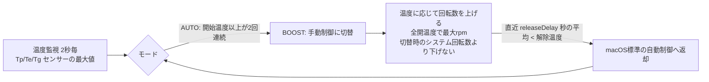

# My Fan Control

Apple Silicon Mac 向けのファン制御アプリ。普段は macOS 標準の自動制御に任せ、**高温になったときだけファンを引き上げて全開まで回し、冷えたら標準制御に戻す**。

> [!WARNING]
> ## 免責事項 / Disclaimer
> 本ソフトウェアは SMC（System Management Controller）へ直接書き込み、Apple が公開していない方法でファンを制御します。
> **使用は完全に自己責任で行ってください。** 本ソフトウェアの使用または使用不能により生じたいかなる損害（ハードウェアの故障・劣化、データの消失、発熱による不具合などを含むがこれに限らない）についても、作者は一切の責任を負いません。サポートや動作保証もありません。
>
> This software writes directly to the SMC and controls fans using undocumented methods. **Use it entirely at your own risk.** The author accepts no responsibility or liability for any damage (including but not limited to hardware failure or degradation, data loss, or thermal issues) arising from the use of, or inability to use, this software. No support or warranty of any kind is provided. See [LICENSE](LICENSE).

## 動作



- 標準設定: 75°C でブースト開始 → 85°C で全開 → 直近30秒の平均が 68°C 未満で標準制御に戻す
- ブースト時の最大回転数は最大回転数の 30〜100% で設定可能（標準 100%）。ただしブースト開始時に macOS 標準制御が回していた回転数より下げることはない
- 回転数の上限は SMC が申告する最大回転数（`F*Mx`）
- デーモン終了時・エラー時は必ず標準制御に戻す
- メニューバーから温度・回転数の確認、有効/無効、しきい値の変更ができる

動作確認環境: MacBook Pro (M4 Max, Mac16,6) / macOS 26

## 構成

| パス | 役割 |
|---|---|
| `Sources/SMCKit/` | SMC 読み書き、制御ロジック、共有設定 |
| `Sources/fanctld/` | root で常駐する制御デーモン（LaunchDaemon） |
| `Sources/MyFanControl/` | メニューバーアプリ（SwiftUI） |
| `Sources/smcprobe/` | SMC キーのダンプ用ツール（`smcprobe F` などで接頭辞指定） |

- 設定: `/Library/Application Support/MyFanControl/config.json`（メニューバーから変更可）
- 状態: `/Library/Application Support/MyFanControl/status.json`
- ログ: `/var/log/myfancontrol.log`

## インストール

Macs Fan Control など他のファン制御アプリは終了（自動起動も無効化）してから実行する。

```sh
./install.sh
```

## アンインストール

```sh
./uninstall.sh
```

ファンは macOS 標準の自動制御に戻る。

## License

[MIT](LICENSE)
